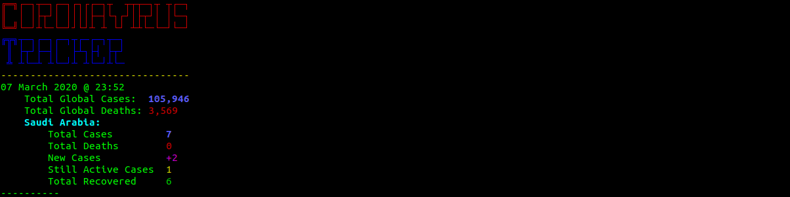

# Coronavirus
Live Coronavirus Tracker

## Description:
A simple Coronavirus live tracker of global and country wide cases. **Update**: Now the tracker only prints whenever the number of reported cases changes (rather than every 15 minutes); if a country is specified then it will print when the number of cases changes in that country, otherwise it will print when the number of cases changes globally.

## How to use:
This is a [Video](https://youtu.be/5eeA_diyZvM) on how to use this setup.

This script works on GNU/Linux Ubuntu 19.10 and over using Python 3.

1. To use this script you will need to first update your system and install the dependencies using the following commands:

`pip3 install beautifulsoup4`

2. Run the script using the following command:

`python3 corona.py COUNTRY_NAME`

where COUNTRY_NAME is the name of the country you want specific detail on. Leave empty to not display any country details.

`example: python3 corona.py saudi arabia`
